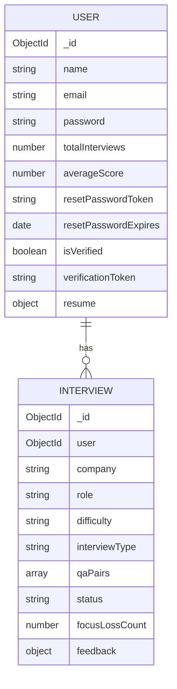
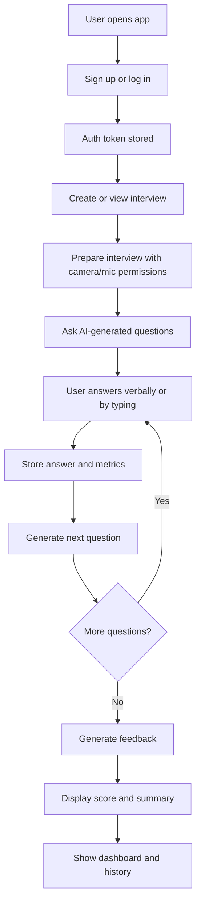
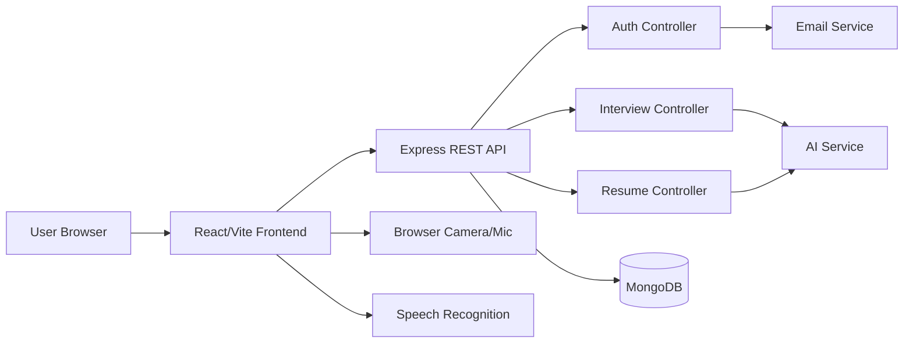

# AstraVox — Complete Technical Report

## 1. Project Overview

AstraVox is a mock interview preparation platform that helps users practice job interviews through an AI-driven experience. The application allows users to create accounts, start interview sessions, answer questions verbally or by typing, and receive AI-generated feedback and scores.

The project solves the business problem of inadequate interview preparation by providing a realistic, interactive practice environment with structured feedback and progress tracking. It is designed for students, job seekers, and professionals who want to improve interview communication, confidence, and preparedness.

Target users include:
- students preparing for internships or placements
- job seekers preparing for interviews
- professionals practicing for career transitions

Why someone would use this project:
- to practice interviews without needing a human interviewer
- to receive AI-generated feedback immediately after each session
- to improve delivery quality, clarity, and confidence
- to track progress over time

## 2. Product Vision

The main objective of AstraVox is to make interview preparation accessible, personalized, and practical by combining conversational AI, speech-based interaction, and actionable feedback in one product.

## 3. Problem Statement

Many candidates struggle to prepare for interviews because they do not have access to realistic, feedback-rich practice environments. Traditional preparation methods often lack personalization and immediate guidance, which makes it harder to improve communication quality and technical interview performance.

AstraVox addresses this by offering a mock interview platform that adapts questions, captures answers, and generates structured feedback.

## 4. Features

### 4.1 User Authentication
- Purpose: Allow users to create accounts and sign in securely.
- How it works: Users submit name, email, and password; the backend hashes the password and stores it; a JWT is issued for authenticated requests.
- Implemented in:
  - [backend/controllers/authController.js](../backend/controllers/authController.js)
  - [backend/routes/authRoutes.js](../backend/routes/authRoutes.js)
  - [backend/utils/generateToken.js](../backend/utils/generateToken.js)
  - [frontend/src/pages/Signup.jsx](../frontend/src/pages/Signup.jsx)
  - [frontend/src/pages/Login.jsx](../frontend/src/pages/Login.jsx)
- Technologies: Express, bcryptjs, jsonwebtoken, React
- API endpoints:
  - POST /api/auth/signup
  - POST /api/auth/login
- Database collections: User

### 4.2 Email Verification
- Purpose: Confirm account ownership.
- How it works: A verification token is created during signup and emailed to the user; the user validates it through the verify-email page.
- Implemented in:
  - [backend/controllers/authController.js](../backend/controllers/authController.js)
  - [backend/services/emailService.js](../backend/services/emailService.js)
  - [frontend/src/pages/VerifyEmail.jsx](../frontend/src/pages/VerifyEmail.jsx)
- Technologies: nodemailer, React
- API endpoints:
  - GET /api/auth/verify-email
  - POST /api/auth/resend-verification
- Database collections: User

### 4.3 Password Reset
- Purpose: Allow users to recover access to their accounts.
- How it works: The backend issues a reset token, stores it temporarily, and emails a reset link.
- Implemented in:
  - [backend/controllers/authController.js](../backend/controllers/authController.js)
  - [frontend/src/pages/ForgotPassword.jsx](../frontend/src/pages/ForgotPassword.jsx)
  - [frontend/src/pages/ResetPassword.jsx](../frontend/src/pages/ResetPassword.jsx)
- Technologies: crypto, nodemailer, React
- API endpoints:
  - POST /api/auth/forgot-password
  - POST /api/auth/reset-password
- Database collections: User

### 4.4 Protected User Profile Management
- Purpose: Let users update profile information and change passwords.
- How it works: Authenticated users can fetch and update their profile data and change their password.
- Implemented in:
  - [backend/controllers/authController.js](../backend/controllers/authController.js)
  - [frontend/src/pages/Profile.jsx](../frontend/src/pages/Profile.jsx)
- Technologies: Express, React, JWT
- API endpoints:
  - GET /api/auth/profile
  - PUT /api/auth/profile
  - PUT /api/auth/change-password
- Database collections: User

### 4.5 Interview Session Creation
- Purpose: Start a new mock interview.
- How it works: The user selects company, role, difficulty, and interview type; the server creates an interview record and generates the first AI question.
- Implemented in:
  - [backend/controllers/interviewController.js](../backend/controllers/interviewController.js)
  - [backend/routes/interviewRoutes.js](../backend/routes/interviewRoutes.js)
  - [frontend/src/pages/NewInterview.jsx](../frontend/src/pages/NewInterview.jsx)
- Technologies: Express, Mongoose, OpenAI-compatible AI service
- API endpoints:
  - POST /api/interviews/start
- Database collections: Interview, User

### 4.6 AI-Generated Interview Questions
- Purpose: Provide realistic, dynamic questions based on prior answers and the selected context.
- How it works: The backend sends a prompt to the AI service with company, role, difficulty, interview type, conversation history, and optional resume analysis.
- Implemented in:
  - [backend/services/aiService.js](../backend/services/aiService.js)
  - [backend/controllers/interviewController.js](../backend/controllers/interviewController.js)
- Technologies: openai SDK, prompt engineering
- API endpoints:
  - Internal service call; no direct public endpoint
- Database collections: Interview

### 4.7 Live Interview Experience
- Purpose: Simulate a realistic interview with voice input and question progression.
- How it works: The frontend uses the browser SpeechRecognition API to capture the user’s speech and submits answers to the backend after each response. The interviewer’s question is spoken aloud using speech synthesis.
- Implemented in:
  - [frontend/src/pages/InterviewSession.jsx](../frontend/src/pages/InterviewSession.jsx)
  - [frontend/src/pages/InterviewPrep.jsx](../frontend/src/pages/InterviewPrep.jsx)
- Technologies: React, Web Speech API, MediaDevices API
- API endpoints:
  - GET /api/interviews/:id
  - POST /api/interviews/:id/answer
- Database collections: Interview

### 4.8 Focus Loss Tracking
- Purpose: Detect when the user leaves the tab during interview practice.
- How it works: A blur event triggers a request to the backend that increments a focusLossCount field.
- Implemented in:
  - [frontend/src/pages/InterviewSession.jsx](../frontend/src/pages/InterviewSession.jsx)
  - [backend/controllers/interviewController.js](../backend/controllers/interviewController.js)
- Technologies: browser events, Express
- API endpoints:
  - POST /api/interviews/:id/focus-loss
- Database collections: Interview

### 4.9 Interview Feedback Generation
- Purpose: Evaluate the interview after completion.
- How it works: The backend builds a transcript, includes delivery metrics and focus-loss information, and sends it to the AI service to generate a structured feedback payload with score, strengths, improvements, suggested topics, and summary.
- Implemented in:
  - [backend/services/aiService.js](../backend/services/aiService.js)
  - [backend/controllers/interviewController.js](../backend/controllers/interviewController.js)
  - [frontend/src/pages/InterviewCompleting.jsx](../frontend/src/pages/InterviewCompleting.jsx)
  - [frontend/src/pages/InterviewFeedback.jsx](../frontend/src/pages/InterviewFeedback.jsx)
- Technologies: openai SDK, React
- API endpoints:
  - POST /api/interviews/:id/end
- Database collections: Interview, User

### 4.10 Interview History and Detail View
- Purpose: Let users review previous interviews.
- How it works: The backend returns the user’s interview list and detail information; the frontend displays them.
- Implemented in:
  - [frontend/src/pages/InterviewHistory.jsx](../frontend/src/pages/InterviewHistory.jsx)
  - [frontend/src/pages/InterviewDetail.jsx](../frontend/src/pages/InterviewDetail.jsx)
  - [backend/controllers/interviewController.js](../backend/controllers/interviewController.js)
- Technologies: React, Express, Mongoose
- API endpoints:
  - GET /api/interviews
  - GET /api/interviews/:id
- Database collections: Interview

### 4.11 Readiness and Activity Analytics
- Purpose: Show interview readiness and practice streaks.
- How it works: The backend computes a readiness score from completed interview scores and calculates a streak from recent completed interviews. The dashboard displays the results.
- Implemented in:
  - [backend/controllers/interviewController.js](../backend/controllers/interviewController.js)
  - [frontend/src/pages/Dashboard.jsx](../frontend/src/pages/Dashboard.jsx)
- Technologies: JavaScript algorithms, React
- API endpoints:
  - GET /api/interviews/readiness
  - GET /api/interviews/activity
- Database collections: Interview, User

### 4.12 Resume Upload and AI Analysis
- Purpose: Allow users to upload a resume so interview questions can be tailored to their background.
- How it works: The backend accepts a PDF upload, parses it with pdf-parse, extracts text, analyzes it via AI, and stores the results on the user profile.
- Implemented in:
  - [backend/controllers/resumeController.js](../backend/controllers/resumeController.js)
  - [backend/routes/resumeRoutes.js](../backend/routes/resumeRoutes.js)
  - [frontend/src/pages/Profile.jsx](../frontend/src/pages/Profile.jsx)
- Technologies: multer, pdf-parse, React
- API endpoints:
  - POST /api/resume/upload
  - GET /api/resume
  - DELETE /api/resume
- Database collections: User

### 4.13 Face-based Delivery Metrics
- Purpose: Capture simple camera-based delivery signals during interviews.
- How it works: The frontend runs face detection using face-api.js while the user is speaking, aggregates samples, and includes the results in speech metrics sent to the backend.
- Implemented in:
  - [frontend/src/utils/faceDetection.js](../frontend/src/utils/faceDetection.js)
  - [frontend/src/pages/InterviewSession.jsx](../frontend/src/pages/InterviewSession.jsx)
- Technologies: face-api.js, React
- API endpoints:
  - POST /api/interviews/:id/answer
- Database collections: Interview

## 5. User Workflow

### 1. Landing and account creation
- The user opens the landing page.
- They can sign up or log in.

### 2. Authentication
- The user submits credentials.
- The backend verifies the user and returns a JWT.
- The frontend stores the token and enters the authenticated experience.

### 3. Profile setup and resume upload
- The user can visit the profile page.
- They may upload a PDF resume for analysis.
- The backend stores the parsed content and AI-generated insights.

### 4. Start interview preparation
- The user navigates to the interview setup page.
- They choose company, role, difficulty, and interview type.

### 5. Interview preparation stage
- The application requests camera and microphone permissions.
- A countdown begins before the interview starts.

### 6. Live interview session
- The app speaks the first question aloud.
- The user answers verbally or by typing.
- The system records speech metrics and face detection samples.
- The next question is generated based on prior conversation.

### 7. Completion and feedback
- When the interview ends or the question limit is reached, the backend generates feedback.
- The user is redirected to the feedback page and sees the score and summary.

### 8. Tracking and history review
- The dashboard shows readiness and activity history.
- The user can inspect old interviews and review detailed answers.

## 6. Folder Structure

### Root
- [package.json](../package.json): root scripts for installing backend/frontend dependencies and running the app.
- [README.md](../README.md): project overview and documentation.
- [backend](../backend): backend service.
- [frontend](../frontend): frontend application.

### Backend
- [backend/server.js](../backend/server.js): Express entry point.
- [backend/config](../backend/config): database configuration.
- [backend/controllers](../backend/controllers): route handlers.
- [backend/middleware](../backend/middleware): auth middleware.
- [backend/models](../backend/models): Mongoose schemas.
- [backend/routes](../backend/routes): router definitions.
- [backend/services](../backend/services): AI and email logic.
- [backend/utils](../backend/utils): shared utility functions.

### Frontend
- [frontend/src](../frontend/src): frontend app source.
- [frontend/src/api](../frontend/src/api): Axios client.
- [frontend/src/components](../frontend/src/components): reusable UI components.
- [frontend/src/context](../frontend/src/context): auth context.
- [frontend/src/pages](../frontend/src/pages): full pages.
- [frontend/src/utils](../frontend/src/utils): face detection utilities.

## 7. Frontend Architecture

### Pages
The frontend contains the following major pages:
- Landing page: [frontend/src/pages/Landing.jsx](../frontend/src/pages/Landing.jsx)
- Signup: [frontend/src/pages/Signup.jsx](../frontend/src/pages/Signup.jsx)
- Login: [frontend/src/pages/Login.jsx](../frontend/src/pages/Login.jsx)
- Forgot password: [frontend/src/pages/ForgotPassword.jsx](../frontend/src/pages/ForgotPassword.jsx)
- Reset password: [frontend/src/pages/ResetPassword.jsx](../frontend/src/pages/ResetPassword.jsx)
- Verify email: [frontend/src/pages/VerifyEmail.jsx](../frontend/src/pages/VerifyEmail.jsx)
- Dashboard: [frontend/src/pages/Dashboard.jsx](../frontend/src/pages/Dashboard.jsx)
- New interview: [frontend/src/pages/NewInterview.jsx](../frontend/src/pages/NewInterview.jsx)
- Interview prep: [frontend/src/pages/InterviewPrep.jsx](../frontend/src/pages/InterviewPrep.jsx)
- Interview session: [frontend/src/pages/InterviewSession.jsx](../frontend/src/pages/InterviewSession.jsx)
- Interview completing: [frontend/src/pages/InterviewCompleting.jsx](../frontend/src/pages/InterviewCompleting.jsx)
- Interview feedback: [frontend/src/pages/InterviewFeedback.jsx](../frontend/src/pages/InterviewFeedback.jsx)
- Interview history: [frontend/src/pages/InterviewHistory.jsx](../frontend/src/pages/InterviewHistory.jsx)
- Interview detail: [frontend/src/pages/InterviewDetail.jsx](../frontend/src/pages/InterviewDetail.jsx)
- Profile: [frontend/src/pages/Profile.jsx](../frontend/src/pages/Profile.jsx)
- Not found: [frontend/src/pages/NotFound.jsx](../frontend/src/pages/NotFound.jsx)

### Components
- [frontend/src/components/Layout.jsx](../frontend/src/components/Layout.jsx): shared shell with navigation and logout.
- [frontend/src/components/ProtectedRoute.jsx](../frontend/src/components/ProtectedRoute.jsx): guards protected routes.
- [frontend/src/components/ErrorBoundary.jsx](../frontend/src/components/ErrorBoundary.jsx): catches unexpected render errors.

### State Management
State is managed locally in each page component and through React context for authentication in [frontend/src/context/AuthContext.jsx](../frontend/src/context/AuthContext.jsx).

### Routing
The application uses React Router via [frontend/src/App.jsx](../frontend/src/App.jsx) with protected and public routes.

### UI Libraries
- React
- React Router
- Tailwind CSS via [frontend/package.json](../frontend/package.json)

### Forms
Forms are implemented directly in the page components using controlled inputs and local state.

### Validation
Validation is mostly client-side and basic; for example, required fields and minimum password length are used in the forms. Server-side validation is also present in the backend controllers.

### Authentication flow
The user logs in or signs up; the token is stored in localStorage; protected pages use the auth context and the token is attached to requests via Axios interceptors.

## 8. Backend Architecture

### Server
The server is created in [backend/server.js](../backend/server.js). It configures Express, loads the database, mounts routes, and serves frontend assets.

### Routes
Routes are grouped by domain:
- [backend/routes/authRoutes.js](../backend/routes/authRoutes.js)
- [backend/routes/interviewRoutes.js](../backend/routes/interviewRoutes.js)
- [backend/routes/resumeRoutes.js](../backend/routes/resumeRoutes.js)

### Controllers
Controllers contain request handling logic:
- [backend/controllers/authController.js](../backend/controllers/authController.js)
- [backend/controllers/interviewController.js](../backend/controllers/interviewController.js)
- [backend/controllers/resumeController.js](../backend/controllers/resumeController.js)

### Services
Services encapsulate external integrations:
- [backend/services/aiService.js](../backend/services/aiService.js)
- [backend/services/emailService.js](../backend/services/emailService.js)

### Middleware
- [backend/middleware/authMiddleware.js](../backend/middleware/authMiddleware.js): JWT verification and user loading.

### Authentication
Authentication is based on JWT bearer tokens.

### Authorization
Authorization is implemented by checking the authenticated user against the resource owner, especially for interviews.

### Error handling
Controllers return HTTP status codes and JSON error messages. The server also has structured error responses for common validation and authorization failures.

### Validation
Validation exists in the controllers for required fields and file type constraints. Database-level validation exists in the Mongoose schemas.

## 9. Database Design

### Collections / Tables

#### Users
Collection: User
Purpose: Stores account and profile information.
Fields:
- _id: ObjectId
- name: String
- email: String (unique)
- password: String
- totalInterviews: Number
- averageScore: Number
- resetPasswordToken: String / null
- resetPasswordExpires: Date / null
- isVerified: Boolean
- verificationToken: String / null
- resume: embedded document with fileName, rawText, uploadedAt, analysis
- timestamps

Relationships:
- One user has many interviews.

#### Interviews
Collection: Interview
Purpose: Stores every interview session and its associated content.
Fields:
- _id: ObjectId
- user: ObjectId reference to User
- company: String
- role: String
- difficulty: String (enum)
- interviewType: String (enum)
- qaPairs: array of embedded question/answer objects
- status: String (enum)
- focusLossCount: Number
- feedback: embedded document with score, strengths, improvements, suggestedTopics, summary
- timestamps

Relationships:
- Many interviews belong to one user.

### ER Diagram



### Indexes
Not found in the codebase. No explicit index definitions were identified beyond the unique constraint on email.

## 10. API Documentation

### Authentication

#### POST /api/auth/signup
- Authentication: None
- Request body:
  - name: string
  - email: string
  - password: string
- Response: 201 with user info and JWT token
- Errors:
  - 400 missing fields or duplicate email
  - 500 server error

#### POST /api/auth/login
- Authentication: None
- Request body:
  - email: string
  - password: string
- Response: 200 with user info and JWT token
- Errors:
  - 400 missing fields
  - 401 invalid credentials
  - 500 server error

#### GET /api/auth/profile
- Authentication: Required (Bearer JWT)
- Response: 200 with authenticated user profile
- Errors:
  - 401 unauthorized

#### PUT /api/auth/profile
- Authentication: Required (Bearer JWT)
- Request body:
  - name: string
  - email: string
- Response: 200 with updated profile data
- Errors:
  - 404 user not found
  - 500 server error

#### PUT /api/auth/change-password
- Authentication: Required (Bearer JWT)
- Request body:
  - currentPassword: string
  - newPassword: string
- Response: 200 success message
- Errors:
  - 400 missing fields
  - 401 incorrect current password
  - 500 server error

#### POST /api/auth/forgot-password
- Authentication: None
- Request body:
  - email: string
- Response: 200 generic success message
- Errors:
  - 500 server error

#### POST /api/auth/reset-password
- Authentication: None
- Request body:
  - resetToken: string
  - newPassword: string
- Response: 200 success message
- Errors:
  - 400 invalid/expired token
  - 500 server error

#### GET /api/auth/verify-email
- Authentication: None
- Query parameters:
  - token: string
- Response: 200 success message
- Errors:
  - 400 invalid token
  - 500 server error

#### POST /api/auth/resend-verification
- Authentication: Required (Bearer JWT)
- Response: 200 success message
- Errors:
  - 404 user not found
  - 400 already verified
  - 500 server error

### Interviews

#### POST /api/interviews/start
- Authentication: Required (Bearer JWT)
- Request body:
  - company: string
  - role: string
  - difficulty: string
  - interviewType: string (optional)
- Response: 201 with interview object and first question
- Errors:
  - 400 missing required fields
  - 500 server error

#### POST /api/interviews/:id/answer
- Authentication: Required (Bearer JWT)
- Request body:
  - answer: string
  - speechMetrics: object (optional)
- Response: 200 with updated interview and done flag
- Errors:
  - 404 interview not found
  - 403 unauthorized
  - 400 already completed
  - 500 server error

#### POST /api/interviews/:id/end
- Authentication: Required (Bearer JWT)
- Response: 200 with completed interview and feedback
- Errors:
  - 404 interview not found
  - 403 unauthorized
  - 500 server error

#### POST /api/interviews/:id/focus-loss
- Authentication: Required (Bearer JWT)
- Response: 200 with updated focusLossCount
- Errors:
  - 404 interview not found
  - 403 unauthorized
  - 500 server error

#### GET /api/interviews/readiness
- Authentication: Required (Bearer JWT)
- Response: 200 with readinessScore, consistency, avgScore, totalInterviews
- Errors:
  - 500 server error

#### GET /api/interviews/activity
- Authentication: Required (Bearer JWT)
- Response: 200 with countsByDay and streak
- Errors:
  - 500 server error

#### GET /api/interviews
- Authentication: Required (Bearer JWT)
- Response: 200 with list of interviews
- Errors:
  - 500 server error

#### GET /api/interviews/:id
- Authentication: Required (Bearer JWT)
- Response: 200 with a single interview
- Errors:
  - 404 interview not found
  - 403 unauthorized
  - 500 server error

### Resume

#### POST /api/resume/upload
- Authentication: Required (Bearer JWT)
- Request body: multipart/form-data with resume file
- Response: 200 with resume object
- Errors:
  - 400 no file or invalid file type
  - 500 server error

#### GET /api/resume
- Authentication: Required (Bearer JWT)
- Response: 200 with resume data
- Errors:
  - 500 server error

#### DELETE /api/resume
- Authentication: Required (Bearer JWT)
- Response: 200 success message
- Errors:
  - 500 server error

## 11. Authentication

Authentication is implemented using JWTs.

How it works:
1. The user signs up or logs in.
2. The backend issues a JWT using [backend/utils/generateToken.js](../backend/utils/generateToken.js).
3. The frontend stores the token in localStorage.
4. The Axios client attaches the token as a Bearer token to every request.
5. The backend middleware verifies the token and attaches the user to the request object.

Notes:
- Cookies are not used.
- Sessions are not used.
- OAuth is not implemented.
- Refresh tokens are not implemented.

## 12. Data Flow

Frontend → Axios client → Backend route → Controller → Service/Model → Database → Response → Frontend UI

Example flow for signup:
1. User fills form in [frontend/src/pages/Signup.jsx](../frontend/src/pages/Signup.jsx)
2. Axios posts to /api/auth/signup
3. [backend/controllers/authController.js](../backend/controllers/authController.js) validates input
4. Password is hashed and stored in MongoDB
5. JWT is generated and returned to the frontend
6. Auth context stores user state and token

Example flow for interview answer submission:
1. The user answers a question in [frontend/src/pages/InterviewSession.jsx](../frontend/src/pages/InterviewSession.jsx)
2. The frontend posts the answer to /api/interviews/:id/answer
3. Controller updates the interview document
4. The AI service generates the next question
5. The updated interview is returned and rendered in the UI

## 13. Business Logic

### Readiness score calculation
In [backend/controllers/interviewController.js](../backend/controllers/interviewController.js), readiness is computed from completed interview scores. The formula combines:
- average score
- consistency based on variance
- a small volume bonus

### Streak calculation
The streak logic finds unique dates of completed interviews and checks whether the most recent interview falls on the current day or previous day.

### Interview question generation
The AI service builds a prompt that includes:
- company and role
- difficulty
- interview type
- previous questions and answers
- resume context if available

### Feedback generation
The AI service produces a JSON score and feedback structure from the transcript and structured metrics.

### Resume analysis
The controller parses uploaded PDFs and analyzes the extracted content with the AI service.

## 14. Technologies Used

### Frontend
- React
- React Router DOM
- Axios
- Tailwind CSS
- Vite
- face-api.js

### Backend
- Node.js
- Express.js
- Mongoose
- jsonwebtoken
- bcryptjs
- multer
- pdf-parse
- nodemailer
- openai SDK
- dotenv
- helmet
- cors
- express-rate-limit

### Database
- MongoDB

### Authentication
- JWT bearer tokens

### Cloud
- Not implemented / not found

### Deployment
- Not implemented / not found

### Libraries
- face-api.js for face detection
- openai for AI generation
- pdf-parse for PDF text extraction

### Tools
- npm
- Vite
- Git

## 15. Third Party Integrations

### OpenAI-compatible AI service
Used for:
- next-question generation
- feedback generation
- resume analysis

Configured via environment variables in [backend/.env](../backend/.env).

### Gmail / nodemailer
Used for:
- verification emails
- password reset emails

### face-api.js CDN models
Used for loading detection models in browser from a remote CDN.

## 16. Security

### Authentication
- JWT-based access control
- protected routes require bearer tokens

### Authorization
- Interview access is restricted to the owning user

### Input validation
- required field checks in controllers
- MIME validation for resume uploads
- file size limit for uploads

### Password hashing
- Passwords are hashed with bcryptjs before storage

### Environment variables
- secrets and API keys are loaded from environment variables

### CORS
- CORS is enabled using the CLIENT_URL environment variable

### Rate limiting
- Auth routes use express-rate-limit to reduce abuse

### Not implemented / not found
- CSRF protection
- refresh tokens
- OAuth
- HTTPS enforcement beyond Express/helmet
- secret rotation
- role-based access control

## 17. Performance Optimizations

The current codebase includes limited optimization techniques:
- local component state for page-level UI
- lightweight API calls and minimal data transfers
- basic request/response efficiency
- no pagination or lazy loading implemented for large datasets
- no explicit caching layer
- no database indexes beyond unique email constraint
- no memoization on frontend rendering paths

## 18. Project Workflow



## 19. Project Architecture Diagram



## 20. Functional Requirements

The following functional requirements are implemented:
- Users can register accounts.
- Users can log in securely.
- Users can verify email addresses.
- Users can reset passwords.
- Users can update profile information.
- Users can change passwords.
- Users can start mock interviews.
- Users can answer interview questions.
- Users can receive AI-generated follow-up questions.
- Users can end interviews and receive feedback.
- Users can view interview history.
- Users can view interview details.
- Users can track readiness metrics.
- Users can view recent activity streaks.
- Users can upload resumes.
- Users can remove resumes.
- Users can receive AI-based resume analysis.
- Users can use camera and microphone permissions before interviews.
- Users can see face-detection-based delivery metrics.

## 21. Non Functional Requirements

The following quality requirements are reflected in the implementation:
- Responsive UI for web-based practice sessions
- JWT-based authentication for access control
- Basic input validation and secure password hashing
- Structured API responses for frontend consumption
- Use of environment variables for secrets and configuration
- Basic rate limiting on authentication routes
- Basic error handling and user feedback

## 22. Modules

### Authentication Module
Responsible for signup, login, profile management, password reset, and email verification.

### Interview Module
Responsible for creating interviews, capturing answers, tracking focus loss, and generating feedback.

### Resume Module
Responsible for PDF upload, parsing, and analysis.

### Analytics Module
Responsible for readiness metrics, activity streak calculation, and dashboard stats.

### UI Module
Responsible for the React pages, navigation, and user-facing experience.

## 23. Future Enhancements

Realistic improvements include:
- add real-time coaching and scoring during live interviews
- add role-based access control
- add refresh token support
- add pagination for history and analytics
- add caching for frequent dashboard requests
- add automated tests and CI/CD pipelines
- add deployment configuration for cloud hosting
- add support for audio transcription using more robust services
- add multi-language interview support

## 24. Resume Description

### 50 words
AstraVox is an AI-powered mock interview platform that helps users practice interviews with dynamic questions, speech-based interaction, and instant feedback. Built with React and Node.js, it supports authentication, resume analysis, interview history, and performance tracking.

### 100 words
AstraVox is a full-stack interview preparation application designed to help job seekers practice realistic mock interviews. The platform combines a React frontend with an Express and MongoDB backend to support user authentication, live interview sessions, AI-generated questions, delivery metrics, resume analysis, and personalized feedback. Users can review past interviews, monitor readiness and activity trends, and improve communication and confidence through guided practice.

### 200 words
AstraVox is a full-stack mock interview platform built to help students and job seekers improve their interview readiness in a practical, low-friction way. The application provides a complete interview preparation workflow, starting with secure user authentication and profile management, followed by interview setup, live interview sessions, and AI-generated feedback. The frontend is implemented in React with protected routes and a polished dashboard experience, while the backend is built with Node.js and Express and uses MongoDB for persistence. The system supports dynamic interview question generation, voice-based interaction, focus-loss tracking, face-based delivery metrics, resume upload and analysis, and detailed interview history. The product is especially useful for candidates who want immediate, personalized guidance without needing a human interviewer. Its architecture is modular and extensible, making it a strong foundation for future features such as advanced coaching, analytics, and deployment automation.

## 25. Portfolio Description

AstraVox is a full-stack AI interview preparation platform that combines modern web development, conversational AI, and practical user experience design. Built with React, Vite, Node.js, Express, and MongoDB, the project delivers secure authentication, live mock interviews, adaptive questioning, personalized feedback, resume analysis, and analytics dashboards. It demonstrates end-to-end product thinking, backend API design, frontend state management, third-party integrations, and real-world user workflows in a single cohesive application.

## 26. GitHub README

# AstraVox

AstraVox is a full-stack AI-powered mock interview preparation platform that helps users practice job interviews through realistic, adaptive sessions and instant feedback.

## Features
- Secure user authentication and profile management
- AI-generated mock interview questions
- Voice-based interview experience with speech input
- Camera-based delivery metrics
- Interview feedback and scoring
- Interview history and detailed review
- Readiness and activity analytics
- Resume upload and AI-based resume analysis

## Tech Stack
### Frontend
- React
- Vite
- React Router
- Tailwind CSS
- Axios
- face-api.js

### Backend
- Node.js
- Express.js
- MongoDB with Mongoose
- JWT authentication
- nodemailer
- multer
- pdf-parse
- openai-compatible AI SDK

## Project Structure
- backend/ — Express server, routes, controllers, middleware, models, services
- frontend/ — React application pages and components

## Installation

### Prerequisites
- Node.js
- npm
- MongoDB instance

### Setup
1. Clone the repository
2. Install dependencies:
   ```bash
   npm run install-all
   ```
3. Create a .env file in backend/ with the required environment variables
4. Start the backend:
   ```bash
   npm start
   ```
5. Start the frontend:
   ```bash
   cd frontend && npm run dev
   ```

## Environment Variables
Create a .env file in the backend directory with:
- PORT
- MONGO_URI
- JWT_SECRET
- JWT_EXPIRES_IN
- OPENAI_API_KEY
- OPENAI_BASE_URL
- OPENAI_MODEL
- CLIENT_URL
- EMAIL_USER
- EMAIL_APP_PASSWORD

## API Overview
The backend exposes REST APIs under /api for:
- authentication
- interviews
- resumes

## Deployment
Not implemented in the repository.

## Screenshots
Placeholder: Add screenshots of landing page, dashboard, interview session, and feedback page.

## License
This project is provided as-is for educational and portfolio purposes.

## Contributors
- Shree Raj Jadhav

## 27. PRD (Product Requirements Document)

### Problem Statement
Candidates often lack access to realistic interview practice and actionable feedback. AstraVox addresses this by offering an AI-driven mock interview experience.

### Objective
Create a web application that allows users to practice interviews, receive AI-generated feedback, and track progress over time.

### Target Users
- students
- job seekers
- early-career professionals

### Features
- account creation and authentication
- mock interview sessions
- AI-generated questions
- feedback and scoring
- resume analysis
- progress tracking

### Functional Requirements
- users can sign up and log in
- users can create and complete interviews
- users can view feedback and history
- users can upload resumes
- users can see readiness metrics

### Non Functional Requirements
- responsive UI
- secure authentication
- reasonable response times
- basic validation and error handling

### Success Metrics
- successful interview sessions completed
- users returning to review history
- positive user feedback on feedback quality

### Future Scope
- live coaching
- multi-language support
- analytics improvements
- deployment automation

## 28. Presentation

### 10-slide presentation outline
1. Title: AstraVox – AI Interview Preparation Platform
2. Problem Statement
3. Product Vision
4. Key Features
5. User Workflow
6. Architecture Overview
7. Database and API Design
8. Security and Performance Considerations
9. Demo Walkthrough
10. Future Roadmap

## 29. Interview Questions

### Q1. How does authentication work in AstraVox?
A. Users sign up or log in, receive a JWT, and the frontend stores it in localStorage. The backend verifies the token using middleware on protected routes.

### Q2. What happens when a user starts a new interview?
A. The backend creates an interview document, uses the AI service to generate the first question, and returns the interview object to the frontend.

### Q3. How is feedback generated?
A. The controller ends the interview, builds a transcript, and sends it to the AI service, which returns structured feedback including score, strengths, improvements, topics, and summary.

### Q4. How is resume analysis implemented?
A. The backend accepts a PDF, parses its text, sends it to the AI service, and stores the analysis on the user profile.

### Q5. What role does face-api.js play?
A. It helps detect face presence and facial expressions during the interview for delivery metrics.

## 30. Code Quality Review

### Dead code
No clear dead code was identified from the reviewed files. However, some UI components appear to be present but not heavily reused.

### Duplicated logic
There is some repeated UI pattern across auth pages, but it is mostly acceptable. The code could be made more DRY with shared form components.

### Security issues
Potential concerns:
- JWTs are stored in localStorage, which is less secure than httpOnly cookies.
- No refresh token mechanism.
- No explicit CSRF protection.
- No role-based permissions beyond resource ownership.

### Performance issues
- face detection runs on an interval and may be expensive on slower devices
- no caching or pagination exists for large history sets
- no explicit indexes for interview query patterns beyond the unique email field

### Code smells
- some components mix UI, data fetching, and business logic in one file
- repeated state handling could be abstracted into reusable hooks or components
- error handling is sometimes generic and could be standardized

### Architecture improvements
- introduce service-layer abstractions for API calls
- add automated tests
- add CI/CD
- add deployment configuration
- add a more robust auth strategy with refresh tokens and httpOnly cookies
